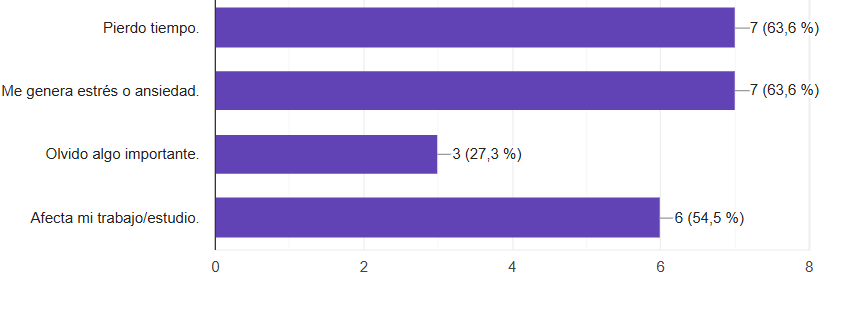
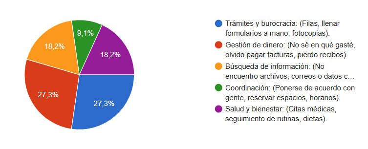
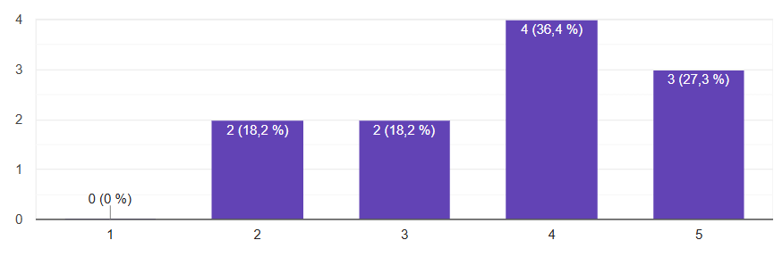

# 🧱 MoneyFlow - Control inteligente de gastos

##  📌**1. El Problema:**
'Esperando la respuesta de un banco con respecto a un pago o movimiento que no tenía claro.'

### Lo que suele pasar con estos problemas:

## 📊**Resultados de la sonda:** 
Se obtienen 11 respuestas y creciendo en la encuesta. En la cual el área más problemática fue la "Gestión de dinero **(27.3%)**, destacándose dificultades como:"
 1. No recordar en qué se gastó el dinero.
 2. Olvidar fechas de pago.
 3. Incertidumbre sobre movimientos bancarios. 

    Con todo lo anterior se pudo reconocer que el nivel de frustración promedio fue de **3.82/5**, lo cual indica que el problema genera alto estrés emocional.

### **Qué area se ve más afectada.**

### **Frustración de los usuarios**

## 👤 ***Historia de usuario Principal***
"Como usuario el cual desea controlar mejor sus finanzas, quiero registrar y visualizar mis ingresos y gastos de forma efectiva y fácilmente, para logra entender en qué gasto mi dinero y evitar el estrés financiero."

## ✅ **Criterios de aceptación**
   1. Debe de poderse registrar un gasto en menos de 10 segundos (conciso y efectivo).
   2. El sistema debe de mostrar balances, analisis y cuantificaciones actualizadas de forma automatica.
   3. El usuario debe recibir alertas antes de fechas de pagos importantes (Cortes, quincenas, etc).

## ⚙️ **Requisitos funcionales**

### **RF-01 (Registro):**
 - El sistema debe permitir registrar ingresos y gastos con montos, categorias, fechas y cortes.

### **RF-02 (Cálculos):**
 - El sistema debe permitir calculos se deben de hacer de forma automatica, al instante y con actualización del balance disponible del usuario.

### **RF-03 (Notificaciones):**
 - El sistema debe de enviar alertas sobre pagos próximos o presupuestos excedidos, filtración de información o la seguridad.

### **RF-04 (Cálculos):**
 - Este debe de mostrar reportes legibles y gráficos de gastos por categoría.

# Enlace del formulario
#### [***Link del formulario***](https://docs.google.com/forms/d/e/1FAIpQLSf786mI8fd16-Dybk3qcDLwe73EbsU2BrBhn3Mrl7iiVMIqKg/viewform?usp=header)

|

|

|

|

|

|

|

|

|

|
# Notas de clase

# Titulo de primer nivel.
## Titulo de segundo nviel.
### Titulo de tercer nivel.
#### Titulo de cuarto nivel.

//si quiero enfatizar de mi proyecto lo dejo en mi titulo de 1 y 2, tambien se pueden crear tablas o enlaces de paginas.

### Creacion de tablas
| Encabezado 1 | Encabezado |
| ------------ | ---------- |
|    Cola 1    |   Cola 2   |

// Numeral (#) titulos y usos

[enlaces a sitio web](https://www.google.com.co)

// Creacion de negrilla o cursiva

**negrilla**

***cursiva***